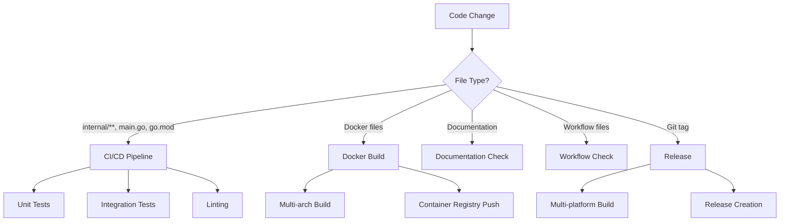

# GitHub Actions Workflows

This directory contains GitHub Actions workflows for CI/CD automation. Each workflow is designed to run only when specific files are changed, optimizing build times and resource usage.

## Workflows Overview

### 🔧 CI/CD Pipeline (`ci.yml`)
**Triggers:** Core application files, Go modules, Docker files, workflow changes
- **Unit Tests**: Runs Go unit tests with coverage
- **Integration Tests**: Runs integration tests (only on main/develop branches)
- **Linting**: Runs golangci-lint for code quality

**Files that trigger this workflow:**
- `internal/**` - Core application code
- `main.go` - Main application entry point
- `go.mod` / `go.sum` - Go module dependencies
- `Dockerfile` / `.dockerignore` - Docker configuration
- `.github/workflows/**` - CI/CD workflow changes

### 🐳 Docker Build (`docker.yml`)
**Triggers:** Application files, Docker files, Docker workflow changes
- **Multi-architecture builds** (linux/amd64, linux/arm64)
- **Automatic publishing** to GitHub Container Registry
- **Build caching** for faster builds

**Files that trigger this workflow:**
- `internal/**` - Core application code
- `main.go` - Main application entry point
- `go.mod` / `go.sum` - Go module dependencies
- `Dockerfile` / `.dockerignore` - Docker configuration
- `.github/workflows/docker.yml` - This workflow file

### 🚀 Release (`release.yml`)
**Triggers:** Git tags (e.g., v1.0.0)
- **Multi-platform builds** for all supported architectures
- **Automatic release creation** with binaries and checksums
- **No path filtering** - runs on any tag creation

### 📚 Documentation Check (`docs.yml`)
**Triggers:** Documentation files only
- **Markdown validation** for README and docs
- **Environment file checks** for completeness
- **PR comments** when documentation changes are detected

**Files that trigger this workflow:**
- `README.md` - Main documentation
- `.env.example` - Environment variables example
- `DOCKER.md` - Docker documentation
- `docs/**` - Additional documentation
- `*.md` - Any markdown files

### ⚙️ Workflow Check (`workflow-check.yml`)
**Triggers:** Workflow files only
- **YAML validation** for all workflow files
- **Trigger configuration checks** for path filtering
- **Workflow structure validation**

**Files that trigger this workflow:**
- `.github/workflows/*.yml` - All workflow files
- `.github/workflows/*.yaml` - All workflow files

## Path Filtering Benefits

### ✅ What triggers workflows:
- **Code changes** in `internal/` directory
- **Dependency changes** in `go.mod`/`go.sum`
- **Docker changes** in `Dockerfile`/`.dockerignore`
- **Workflow changes** in `.github/workflows/`
- **Documentation changes** in markdown files
- **Release tags** (v*)

### ❌ What doesn't trigger workflows:
- **Documentation-only changes** (README, .md files) - only docs workflow runs
- **Workflow-only changes** - only workflow-check runs
- **Changes to non-core files** (assets, examples, etc.)
- **Changes to ignored files** (.gitignore patterns)

## Workflow Dependencies

## Optimization Features

1. **Path-based triggers** - Only run when relevant files change
2. **Conditional jobs** - Integration tests only on main/develop
3. **Build caching** - Docker and Go module caching
4. **Parallel execution** - Jobs run in parallel when possible
5. **Resource efficiency** - Minimal runner usage

## Manual Workflow Triggers

You can manually trigger workflows from the GitHub Actions tab:
1. Go to **Actions** tab in your repository
2. Select the workflow you want to run
3. Click **Run workflow**
4. Choose the branch and click **Run workflow**

## Troubleshooting

### Workflow not running?
- Check if the changed files match the `paths` filter
- Verify the branch is in the `branches` list
- Check workflow syntax in the Actions tab

### Build failures?
- Check the **Actions** tab for detailed logs
- Verify all required secrets are set
- Check if dependencies are up to date

### Performance issues?
- Workflows are optimized with path filtering
- Build caching reduces build times
- Parallel execution improves speed